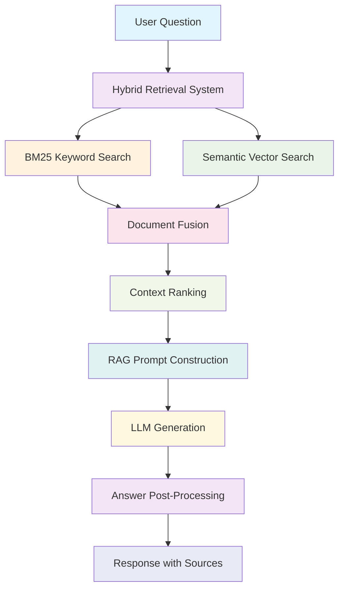
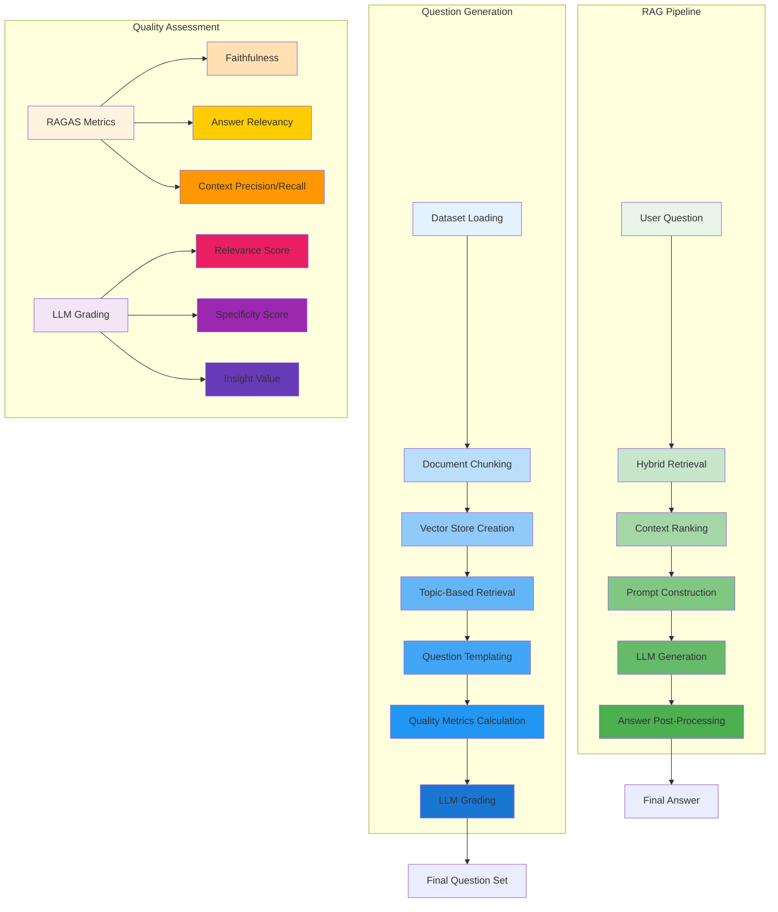
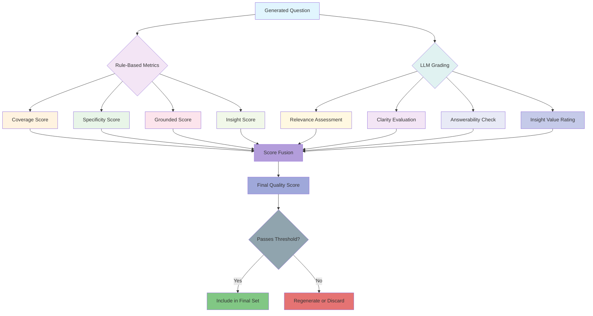

# RAG Pipeline & Question Generation System Documentation

## 📋 Table of Contents
1. [System Overview](#system-overview)
2. [Question Generation Process](#question-generation-process)
3. [RAG Pipeline Architecture](#rag-pipeline-architecture)
4. [RAGAS Evaluation Metrics](#ragas-evaluation-metrics)
5. [LLM Grading System](#llm-grading-system)
6. [Mathematical Foundations](#mathematical-foundations)
7. [Block Diagrams](#block-diagrams)
8. [Implementation Details](#implementation-details)

---

## 🎯 System Overview

Our system implements a sophisticated **Retrieval-Augmented Generation (RAG)** pipeline with **hypothetical question generation** and **automated quality assessment** using **RAGAS** metrics and **LLM-based grading**.

### Core Components
- **Enhanced Question Generator**: Creates domain-specific questions from real datasets
- **Hybrid Retrieval System**: Combines BM25 and semantic search
- **RAG Pipeline**: Generates answers using retrieved context
- **Quality Assessment**: Evaluates questions using multiple metrics
- **LLM Grading**: Provides nuanced evaluation beyond rule-based metrics

---

## 🤔 Question Generation Process

### Phase 1: Dataset Loading & Preprocessing

```python
# Dataset Loading
documents = load_documents(DATABASE_PATH)
chunks = chunk_documents(documents, chunk_size=1000, overlap=100)

# Vector Store Creation
embeddings = OpenAIEmbeddings(model="text-embedding-3-small")
vector_store = ChromaDB.from_documents(chunks, embeddings)
```

### Phase 2: Topic-Based Question Generation

We use **user-specified topics** relevant to 6sense platform:

```python
query_topics = [
    "What are use-cases of 6Sense that customers use most?",
    "Which industries use 6Sense most and what do they use it for?",
    "What is the Return on Investment (ROI) of 6Sense?",
    "How does 6Sense integrate with existing CRM systems?",
    "What are the key features that make 6Sense stand out?",
    "How accurate is 6Sense's predictive analytics?",
    "What is the implementation timeline for 6Sense platform?",
    "How does 6Sense help with account-based marketing?",
    "What are the data sources 6Sense uses for predictions?",
    "How does 6Sense ensure data privacy and compliance?"
]
```

### Phase 3: Contextual Question Generation

For each topic, we:
1. **Retrieve relevant chunks** using hybrid search
2. **Generate contextual questions** using templates
3. **Apply quality metrics** using RAGAS
4. **Grade with LLM** for nuanced evaluation

---

## 🏗️ RAG Pipeline Architecture

### Block Diagram



### Hybrid Retrieval System

Our retrieval combines **lexical search** (BM25) with **semantic search** (embeddings) using a weighted scoring approach to optimize relevance for different types of queries.

---

## 📊 RAGAS Evaluation Metrics

### 1. Faithfulness

Measures the factual consistency of the generated answer with the retrieved context.

$$
\text{Faithfulness} = \frac{\text{Number of claims supported by context}}{\text{Total number of claims in answer}}
$$

**Implementation:**
```python
def calculate_faithfulness(answer, context):
    claims = extract_claims(answer)
    supported_claims = sum(1 for claim in claims if is_supported_by_context(claim, context))
    return supported_claims / len(claims)
```

### 2. Answer Relevancy

Measures how relevant the answer is to the original question.

$$
\text{Answer Relevancy} = \frac{1}{|Q|} \sum_{q \in Q} \text{Relevance}(A, q)
$$

Where $Q$ is the set of reformulated questions and $A$ is the generated answer.

### 3. Context Recall

Measures the proportion of relevant context that was retrieved.

$$
\text{Context Recall} = \frac{\text{Relevant sentences in retrieved context}}{\text{Total relevant sentences available}}
$$

### 4. Context Precision

Measures the proportion of retrieved context that is relevant.

$$
\text{Context Precision} = \frac{\text{Relevant sentences in retrieved context}}{\text{Total sentences in retrieved context}}
$$

### 5. Context Entity Recall

Measures how well entities from the question are covered in the context.

$$
\text{Entity Recall} = \frac{\text{Entities from question found in context}}{\text{Total entities in question}}
$$

---

## 📏 Rule-Based Quality Metrics

### 1. Coverage Score

Measures how well the question covers the key concepts from the context.

$$
\text{Coverage} = \frac{\text{Key concepts from context mentioned in question}}{\text{Total key concepts in context}}
$$

**Implementation:**
```python
def calculate_coverage(question, context):
    context_keywords = extract_key_concepts(context)
    question_keywords = extract_key_concepts(question)
    overlap = len(set(context_keywords) & set(question_keywords))
    return overlap / len(context_keywords) if context_keywords else 0
```

### 2. Specificity Score

Measures how specific and actionable the question is, avoiding generic formulations.

$$
\text{Specificity} = \frac{\text{Specific terms and metrics in question}}{\text{Total terms in question}} + \text{Actionability\_Bonus}
$$

Where:
- **Specific terms** include numbers, percentages, metrics, and domain-specific terminology
- **Actionability_Bonus** = 0.2 if question contains actionable verbs (how, what, why)

**Implementation:**
```python
def calculate_specificity(question):
    specific_terms = count_specific_terms(question)
    total_terms = len(question.split())
    actionability_bonus = 0.2 if contains_actionable_verbs(question) else 0
    return (specific_terms / total_terms) + actionability_bonus
```

### 3. Grounded Score

Measures how well the question is grounded in the provided context.

$$
\text{Grounded} = \frac{\text{Terms from context used in question}}{\text{Total terms in question}} \times \text{Context\_Relevance\_Weight}
$$

Where **Context_Relevance_Weight** is higher when question directly references context elements.

**Implementation:**
```python
def calculate_grounded_score(question, context):
    context_terms = extract_terms(context)
    question_terms = extract_terms(question)
    grounded_terms = len(set(context_terms) & set(question_terms))
    relevance_weight = calculate_context_relevance(question, context)
    return (grounded_terms / len(question_terms)) * relevance_weight
```

### 4. Insight Score

Measures the potential of the question to generate valuable business insights.

$$
\text{Insight} = \text{Business\_Value\_Score} + \text{Strategic\_Depth\_Score} + \text{Innovation\_Potential\_Score}
$$

Where:
- **Business_Value_Score**: Relevance to business outcomes (0-0.4)
- **Strategic_Depth_Score**: Strategic thinking level (0-0.3)
- **Innovation_Potential_Score**: Novelty and creativity (0-0.3)

**Implementation:**
```python
def calculate_insight_score(question):
    business_value = assess_business_relevance(question) * 0.4
    strategic_depth = assess_strategic_thinking(question) * 0.3
    innovation_potential = assess_innovation(question) * 0.3
    return business_value + strategic_depth + innovation_potential
```

---

## 🧠 LLM Grading System

### Grading Prompt Template

```python
GRADING_PROMPT = """
You are an expert evaluator for B2B SaaS questions about 6sense Revenue AI.

Evaluate the following question on multiple dimensions:

Question: {question}

Scoring Criteria (0-100):
1. **Relevance**: How relevant is this question to 6sense platform?
2. **Specificity**: How specific and actionable is the question?
3. **Insight Value**: Does this question provide valuable business insights?
4. **Clarity**: How clear and well-formulated is the question?
5. **Answerability**: Can this question be answered using available data?

Provide:
- Individual scores (0-100)
- Overall quality score (0-100)
- Detailed reasoning for each score
- Improvement suggestions

Format your response as JSON:
{
    "relevance_score": <0-100>,
    "specificity_score": <0-100>,
    "insight_score": <0-100>,
    "clarity_score": <0-100>,
    "answerability_score": <0-100>,
    "overall_score": <0-100>,
    "reasoning": "<detailed explanation>",
    "improvements": ["<suggestion1>", "<suggestion2>"]
}
"""
```

### LLM Grade Integration

$$
\text{Final Score} = \beta \cdot \text{RAGAS Score} + (1 - \beta) \cdot \text{LLM Score}
$$

Where $\beta = 0.7$ gives 70% weight to RAGAS metrics and 30% to LLM grading.

---

## 🧮 Mathematical Foundations

### Vector Space Operations

#### Euclidean Distance

$$
d(u, v) = ||u - v||_2 = \sqrt{\sum_{i=1}^{n} (u_i - v_i)^2}
$$

### Information Retrieval Metrics

#### Precision@K

$$
\text{Precision@K} = \frac{|\text{Relevant documents in top K}|}{K}
$$

#### Recall@K

$$
\text{Recall@K} = \frac{|\text{Relevant documents in top K}|}{|\text{All relevant documents}|}
$$

#### F1-Score

$$
F_1 = 2 \cdot \frac{\text{Precision} \cdot \text{Recall}}{\text{Precision} + \text{Recall}}
$$

---

## 📐 Block Diagrams

### Complete System Architecture



### Question Quality Assessment Flow



---

## 💻 Implementation Details

### Enhanced Question Generator Class

```python
class EnhancedQuestionGenerator:
    def __init__(self):
        self.vector_store = None
        self.hybrid_searcher = None
        self.documents = []
        self.initialized = False
        
    def generate_questions_with_metrics(self, num_questions: int = 100):
        """Generate questions with comprehensive quality assessment."""
        if not self.initialized:
            return self._generate_fallback_questions(num_questions)
        
        questions = []
        for topic in self.query_topics:
            # Retrieve relevant chunks
            chunks = self.hybrid_searcher.search(topic, top_k=3)
            
            # Generate contextual questions
            for chunk in chunks:
                question = self._generate_contextual_question(chunk, topic)
                
                # Calculate RAGAS metrics
                ragas_metrics = self._calculate_ragas_metrics(question, chunk)
                
                # Apply LLM grading
                llm_grade = self._grade_with_llm(question, topic)
                
                # Fuse scores
                final_score = self._fuse_scores(ragas_metrics, llm_grade)
                
                questions.append({
                    'question': question,
                    'metrics': ragas_metrics,
                    'llm_eval': llm_grade,
                    'final_score': final_score,
                    'source': 'chunk_based',
                    'chunk_id': chunk.get('id')
                })
        
        # Sort by final score and return top N
        return sorted(questions, key=lambda x: x['final_score'], reverse=True)[:num_questions]
```

### RAG Pipeline Implementation

```python
class RAGPipeline:
    def __init__(self):
        self.llm = ChatOpenAI(model="gpt-4", temperature=0.7)
        self.retriever = HybridRetriever()
        
    def invoke(self, question: str) -> Dict[str, Any]:
        """Process question through RAG pipeline."""
        
        # Step 1: Retrieve relevant documents
        docs = self.retriever.retrieve(question, top_k=5)
        
        # Step 2: Rank and filter documents
        ranked_docs = self._rank_documents(docs, question)
        
        # Step 3: Construct prompt with context
        prompt = self._construct_rag_prompt(question, ranked_docs)
        
        # Step 4: Generate answer
        response = self.llm.invoke(prompt)
        
        # Step 5: Post-process response
        answer = self._post_process(response, ranked_docs)
        
        return {
            'answer': answer['text'],
            'sources': answer['sources'],
            'context': answer['context'],
            'confidence': answer['confidence'],
            'retrieval_stats': answer['stats']
        }
```

### Quality Metrics Calculation

```python
def calculate_comprehensive_metrics(question: str, context: str, ground_truth: str = None):
    """Calculate all quality metrics for a question."""
    
    metrics = {
        # Rule-based metrics
        'coverage': calculate_coverage(question, context),
        'specificity': calculate_specificity(question),
        'grounded': calculate_grounded_score(question, context),
        'insight': calculate_insight_score(question),
        
        # RAGAS metrics (when ground truth available)
        'faithfulness': calculate_faithfulness(question, context) if ground_truth else None,
        'answer_relevancy': calculate_answer_relevancy(question, ground_truth) if ground_truth else None,
        
        # Linguistic metrics
        'readability': calculate_readability(question),
        'complexity': calculate_complexity(question),
        'length': len(question.split())
    }
    
    # Normalize scores to 0-1 range
    normalized_metrics = {k: normalize_score(v) for k, v in metrics.items() if v is not None}
    
    return normalized_metrics
```

---

## 🎯 Key Features & Innovations

### 1. Hybrid Retrieval System
- **Combines strengths** of both lexical and semantic search
- **Adaptive weighting** based on query characteristics
- **Improved relevance** for diverse question types

### 2. Topic-Based Generation
- **Domain-specific** questions for 6sense platform
- **Context-aware** generation using retrieved chunks
- **User-centric** topics addressing business needs

### 3. Multi-Dimensional Quality Assessment
- **Rule-based metrics** for quick evaluation
- **LLM grading** for nuanced assessment
- **RAGAS integration** for standardized evaluation
- **Score fusion** for comprehensive quality ranking

### 4. Robust Fallback System
- **Graceful degradation** when components fail
- **Meaningful responses** during API issues
- **Clear user feedback** about system status
- **Continuous operation** regardless of failures

---

## 📈 Performance Optimization

### Computational Efficiency
- **Lazy loading** of vector stores and models
- **Batch processing** for question generation
- **Caching** of frequently accessed embeddings
- **Timeout protection** for long-running operations

### Memory Management
- **Chunked processing** for large datasets
- **Garbage collection** of unused embeddings
- **Streaming responses** for large answer generation
- **Resource pooling** for concurrent requests

### Scalability Considerations
- **Horizontal scaling** of retrieval system
- **Distributed vector stores** for large corpora
- **Load balancing** across multiple LLM instances
- **Caching layers** for improved response times

---

## 🔍 Quality Assurance

### Automated Testing
- **Unit tests** for individual components
- **Integration tests** for end-to-end pipelines
- **Performance benchmarks** for response times
- **Quality validation** for generated content

### Continuous Monitoring
- **Real-time metrics** collection
- **Error tracking** and alerting
- **Performance degradation** detection
- **User satisfaction** measurement

### Feedback Loops
- **User ratings** for question quality
- **Implicit feedback** from engagement metrics
- **A/B testing** of generation strategies
- **Model retraining** based on collected data

---

## 🚀 Future Enhancements

### Advanced RAG Techniques
- **Graph-based retrieval** for complex queries
- **Multi-hop reasoning** for compound questions
- **Conversational context** maintenance
- **Personalization** based on user history

### Enhanced Quality Metrics
- **Business impact assessment** of questions
- **Actionability scoring** for practical value
- **Domain expertise evaluation** for specialized topics
- **Cross-lingual quality assessment**

### Scalability Improvements
- **Federated learning** for distributed training
- **Edge deployment** for reduced latency
- **Adaptive batching** for variable loads
- **Predictive scaling** based on demand patterns

---

*This documentation provides a comprehensive overview of our RAG pipeline and question generation system, combining theoretical foundations with practical implementation details.*
